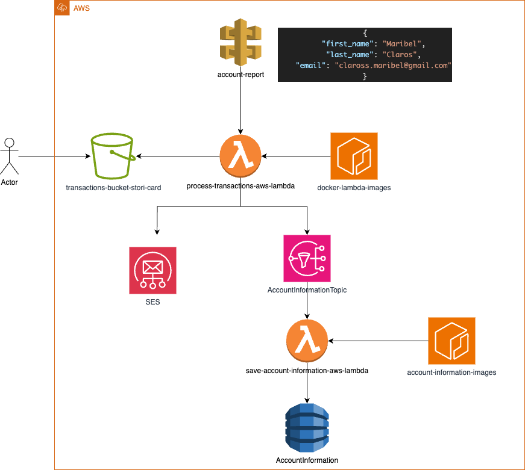

# Stori Card Challenge

This challenge consists of building a solution for processing transaction data for Stori Card. A `.csv` file containing transactions is uploaded to an S3 bucket, then processed by AWS Lambda. The resulting account summary is stored in DynamoDB and sent via email using Amazon SES, and a notification is published through SNS.

## Architecture

## Installation

To run this project, follow these steps:

1. **AWS Account**  
   You must have an active AWS account.

2. **S3 Bucket**  
   Create an S3 bucket named `transactions-bucket-stori-card`.  
   Upload a `.csv` file with transactions.
   > An example CSV file can be found in:  
   > `process-transactions-aws-lambda/resources/sample.csv`

3. **ECR Repositories**  
   Create two Elastic Container Registry (ECR) repositories for your Lambda Docker images:

    - `docker-lambda-images`: to host the image for the `process-transaction-aws-lambda`. For detailed instructions, see the [Create Lambda and push Dockerfile](./process-transactions-aws-lambda/README.md).

     - `account-information-images`: to host the image for the `save-account-information-aws-lambda`, For detailed instructions, see the [Create Lambda and push Dockerfile](./save-account-information-aws-lambda/README.md). 

4. **SES Identities**  
   Set up email identities in Amazon SES for both sender and recipient addresses.

5. **SNS Topic**  
   Create a **Standard SNS Topic** named `AccountInformationTopic`.  
   Then, update the ARN in the `aws_config.json` file inside the `process-transaction-aws-lambda` project.

6. **DynamoDB Table**  
   Create a DynamoDB table named `AccountInformation` with the following configuration:

    - Partition key: `id` (String)
    - No sort key

7. **API Gateway**  
   Create a REST API Gateway with **Lambda Proxy Integration**, connected to the `process-transaction-aws-lambda`.

## Notes

- The project uses AWS Lambda with Docker images.
- Make sure to set up IAM roles with the necessary permissions for:
    - S3 access
    - SES email sending
    - DynamoDB read/write
    - SNS publish/subscribe
    - I'm using us-east-1 region
    - The format Date in .csv must be MM/DD
